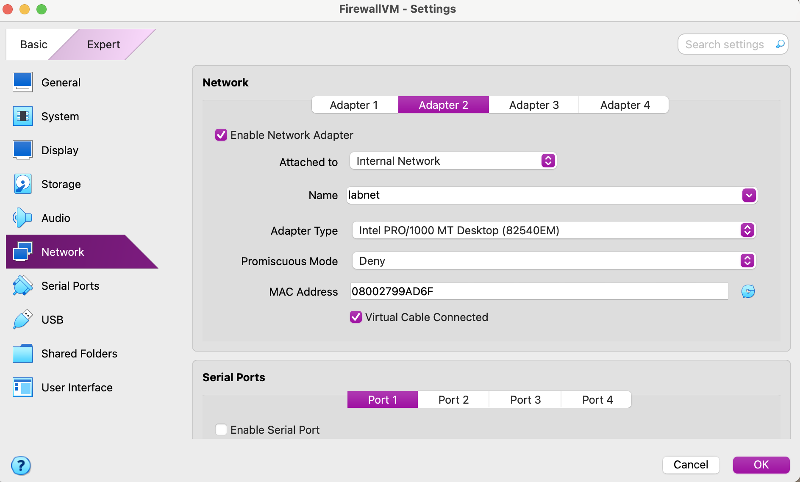
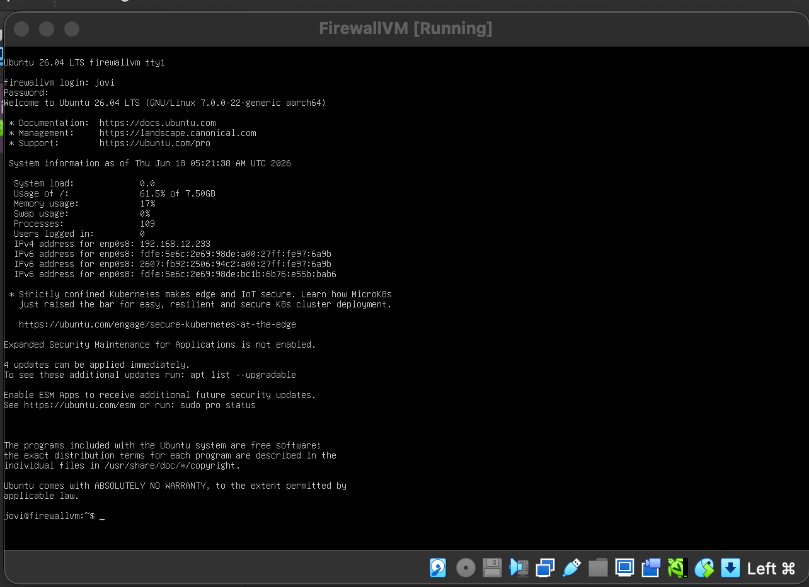
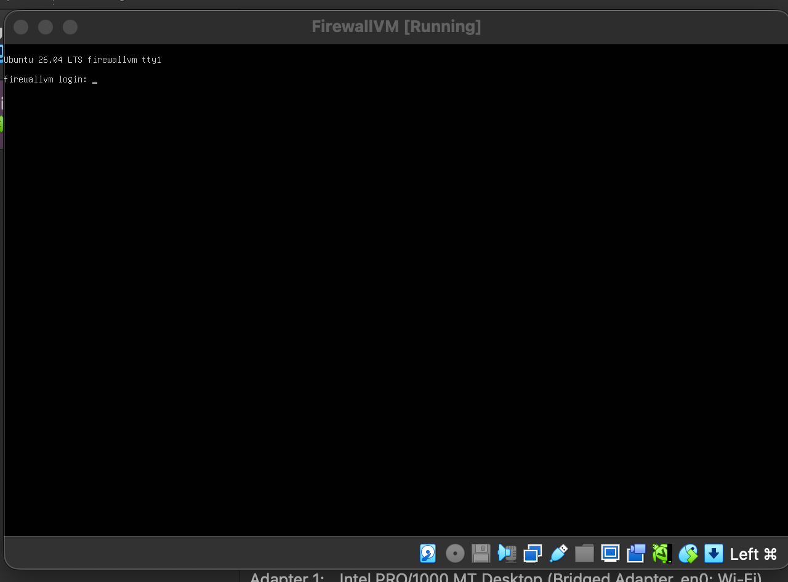
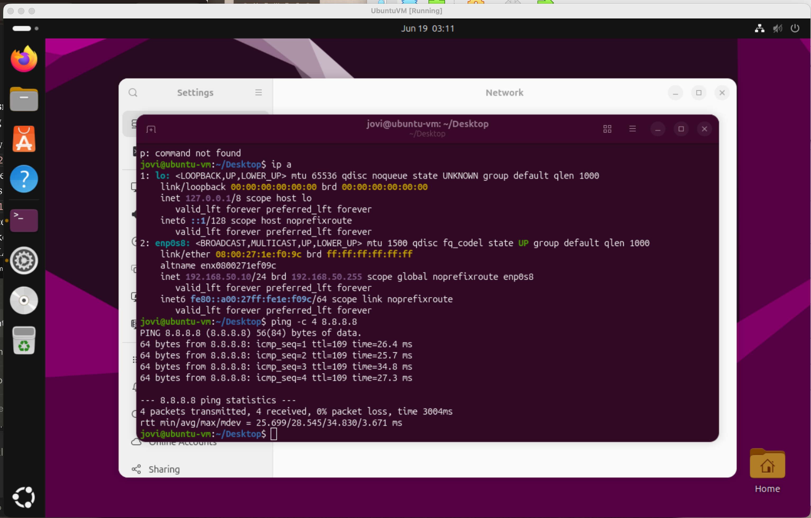
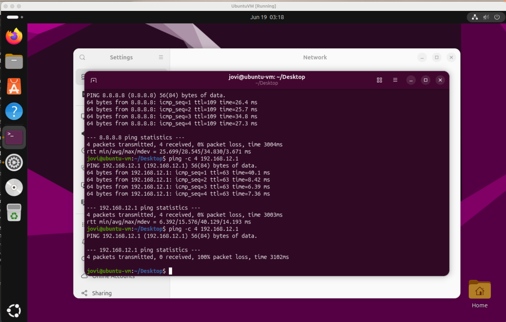

# 01 — Virtual Firewall Lab: VirtualBox Network Segmentation

## What This Is
A self-built virtual firewall/router running on Ubuntu Server inside VirtualBox, isolating
lab VMs on a private internal network while still allowing outbound internet access —
built as a software substitute for pfSense/OPNsense after discovering neither has an
ARM64 build compatible with Apple Silicon.

## Problem
The original plan called for pfSense or OPNsense as a virtual firewall to isolate lab VMs
from the home network. Both are x86-only with no official ARM64 support, making them
unusable on an Apple Silicon Mac. Needed a working substitute that still taught real
firewall/NAT/routing concepts.

## Solution
Built a dedicated Ubuntu Server VM with two network interfaces — one bridged to the home
network (acting as WAN), one on a private VirtualBox Internal Network called "labnet"
(acting as LAN). Enabled IP forwarding and configured iptables NAT (MASQUERADE) so labnet
clients could reach the internet through the firewall. Discovered NAT alone still allowed
direct access to the home network, then added explicit iptables FORWARD rules to block
that path while preserving internet access — proving true network isolation.

## Stack
- VirtualBox 7.2 (Apple Silicon / ARM64)
- Ubuntu Server 26.04 LTS (ARM64) — FirewallVM
- Ubuntu Desktop (ARM64) — client VM (UbuntuVM)
- iptables / netfilter-persistent — NAT + firewall rules
- netplan — static IP configuration

## Network
| Component | Network | Interface | IP |
|---|---|---|---|
| FirewallVM | Home network (Bridged) | enp0s8 | DHCP (home router) |
| FirewallVM | labnet (Internal) | enp0s9 | 192.168.50.1 (gateway) |
| UbuntuVM | labnet (Internal) | enp0s8 | 192.168.50.10 |

## What I Did
- Identified pfSense/OPNsense as ARM64-incompatible, pivoted to a Linux-based firewall
- Created a VirtualBox Internal Network ("labnet") to isolate lab VM traffic
- Built FirewallVM with dual NICs: Bridged (WAN) + Internal Network (LAN)
- Enabled IP forwarding permanently via /etc/sysctl.conf
- Configured a static IP on the labnet-facing interface via netplan
- Wrote and permanently saved an iptables MASQUERADE rule for NAT
- Connected UbuntuVM to labnet with a static IP, gateway, and DNS
- Verified internet access through the firewall (ping 8.8.8.8 successful)
- Discovered NAT alone did not block access to the home network
- Added an iptables FORWARD DROP rule blocking labnet → home subnet traffic
- Re-verified: internet still works, home network access now fully blocked

## Resume Line
"Built isolated virtualization lab with virtual firewall for safe enterprise simulation"

## Screenshots

**labnet internal network adapter configuration**

**FirewallVM first successful login after install**

**Clean reboot after disabling cloud-init (boot hang fix)**

**NAT working — internet access through the firewall**

**Isolation confirmed — internet allowed, home network blocked**

