# 03 — osTicket Help Desk Lab

## Overview
Deployed osTicket v1.17.5 as a fully functional IT help desk ticketing system on a native LAMP stack (Linux, Apache, MySQL, PHP) inside an Ubuntu Server 26.04 LTS ARM64 VM running on VirtualBox. Simulated real-world IT support scenarios by creating and resolving mock tickets.

## Environment
- **Host:** MacBook Air (Apple Silicon, ARM64)
- **Hypervisor:** VirtualBox 7.2
- **Guest OS:** Ubuntu Server 26.04 LTS (ARM64)
- **VM Specs:** 2GB RAM, 2 vCPUs, 25GB virtual disk
- **Stack:** Apache2, PHP 8.5, MySQL 8.4, osTicket v1.17.5
- **Access:** SSH via VirtualBox port forwarding (Host 2222 → Guest 22)
- **Web Access:** http://localhost:8080 via port forwarding (Host 8080 → Guest 80)

## What Was Built

### Step 1 — Docker Installed (later abandoned)
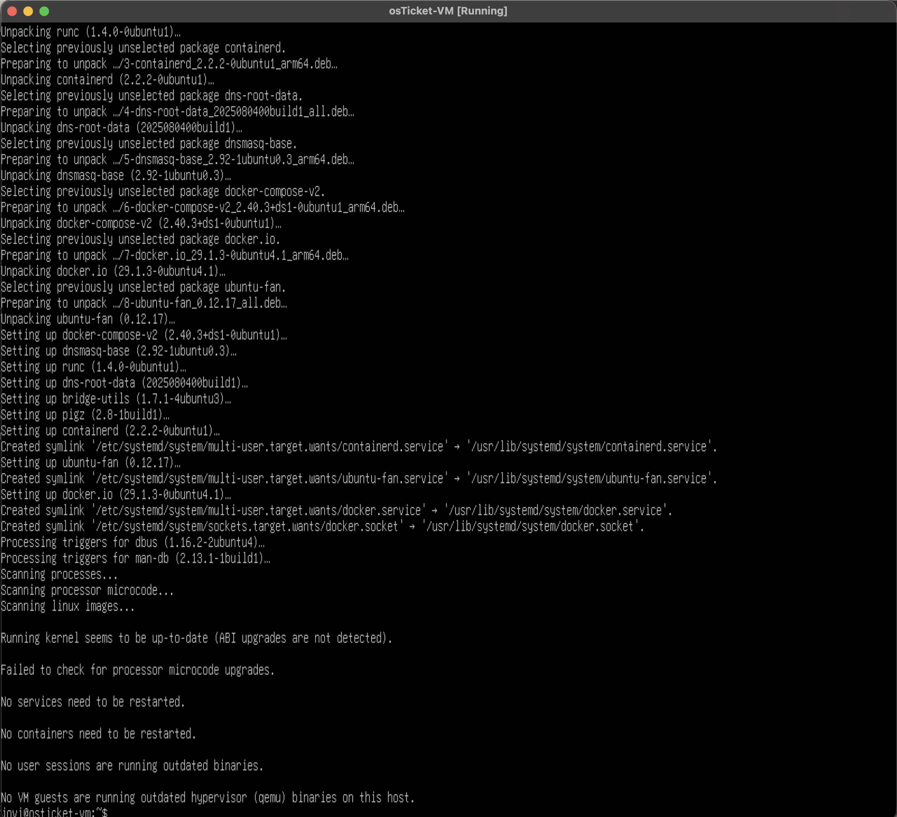

### Step 2 — SSH Access Configured
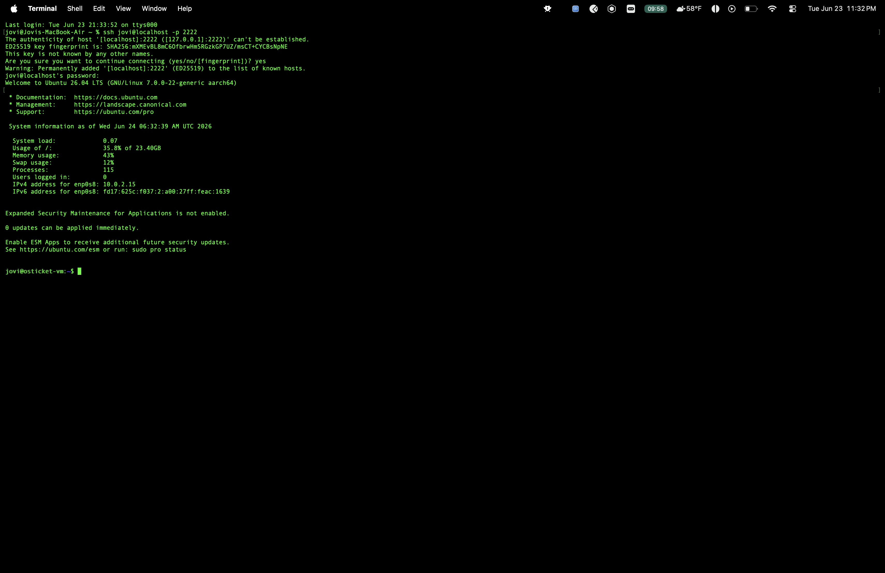

### Step 3 — osTicket Installer (initial missing extensions)

### Step 4 — All Prerequisites Met
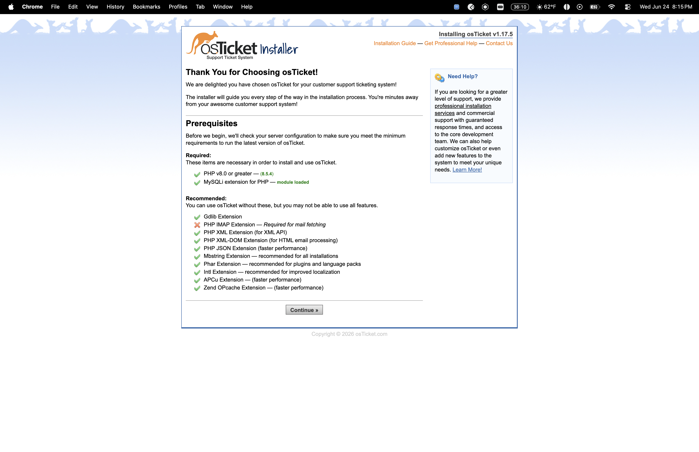

### Step 5 — Installation Complete
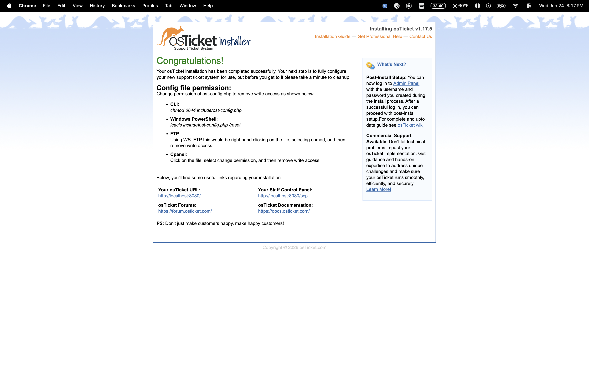

### Step 6 — Post-Install Cleanup
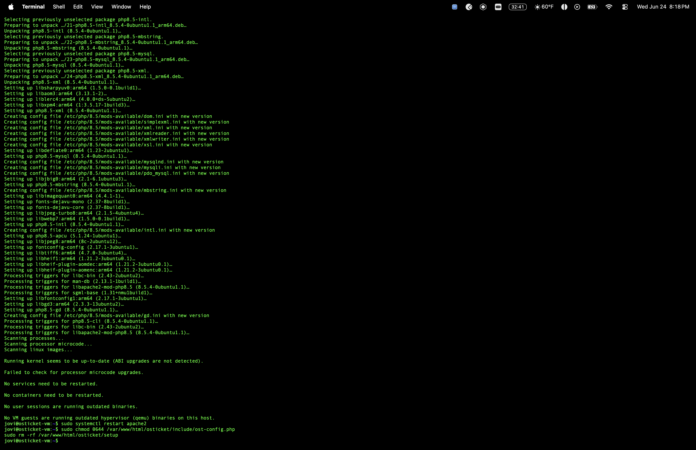

### Step 7 — Login Page Live

### Step 8 — Staff Control Panel
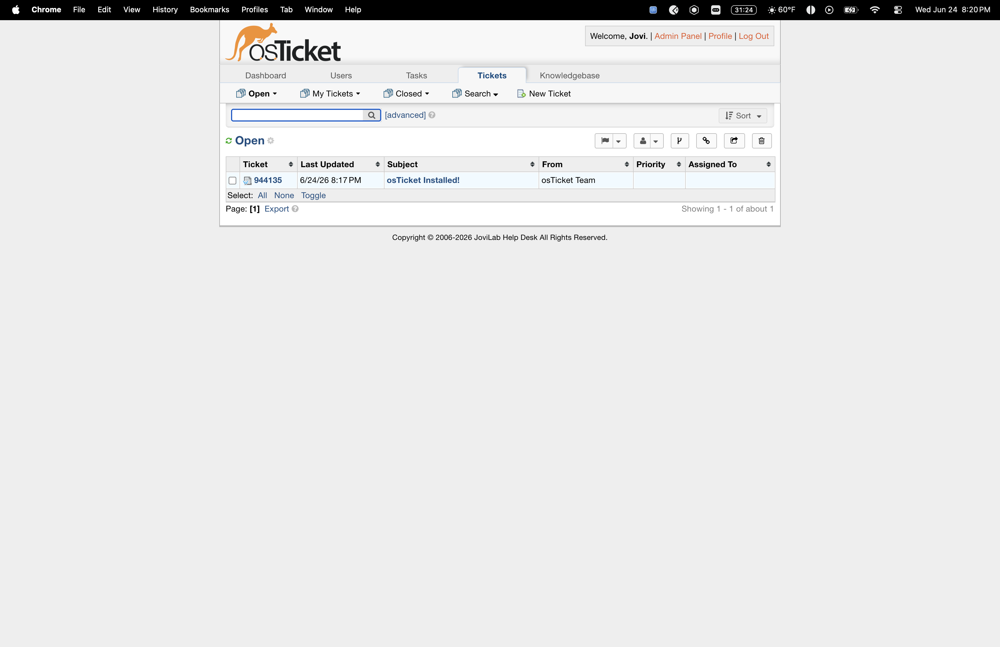

## Mock Ticket Simulations

### Ticket 1 — Password Reset
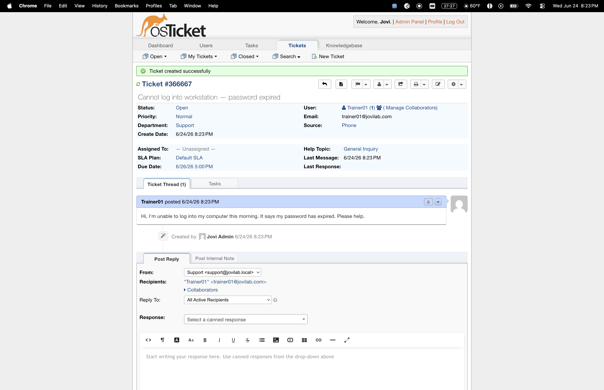
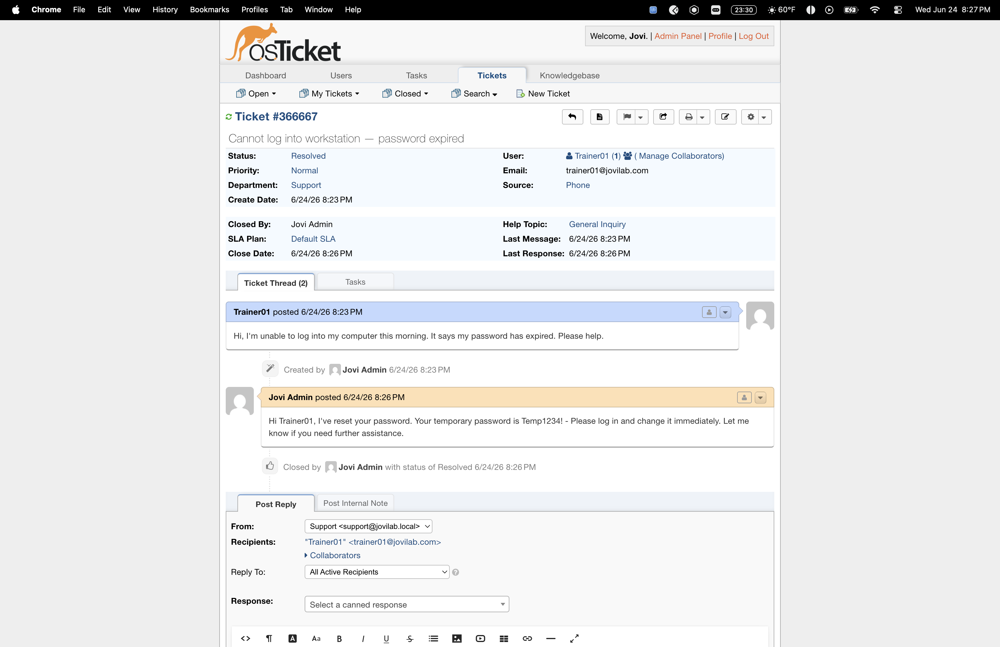

### Ticket 2 — Account Lockout
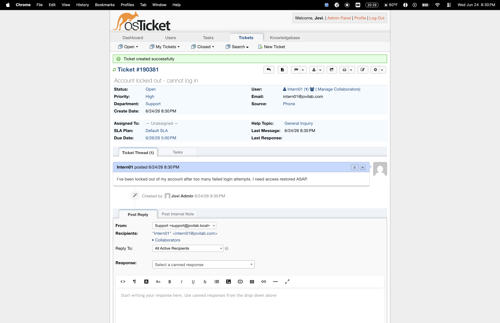
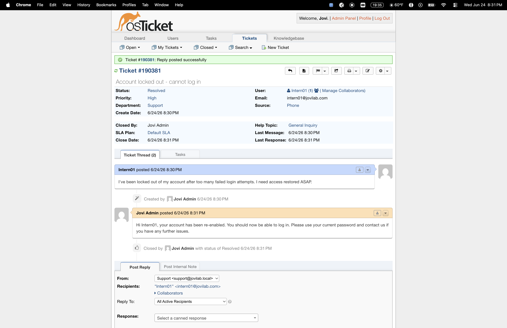

### Ticket 3 — Software Crash (Outlook)
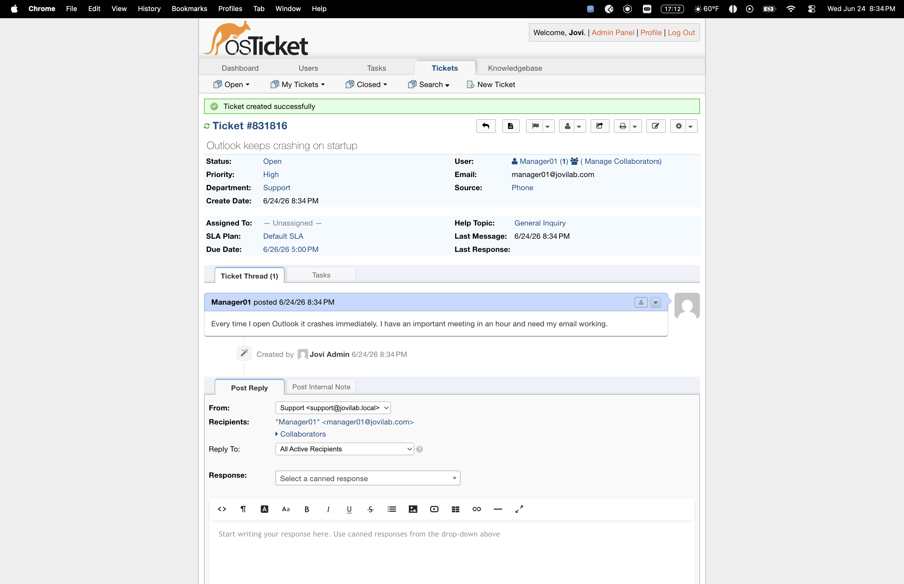
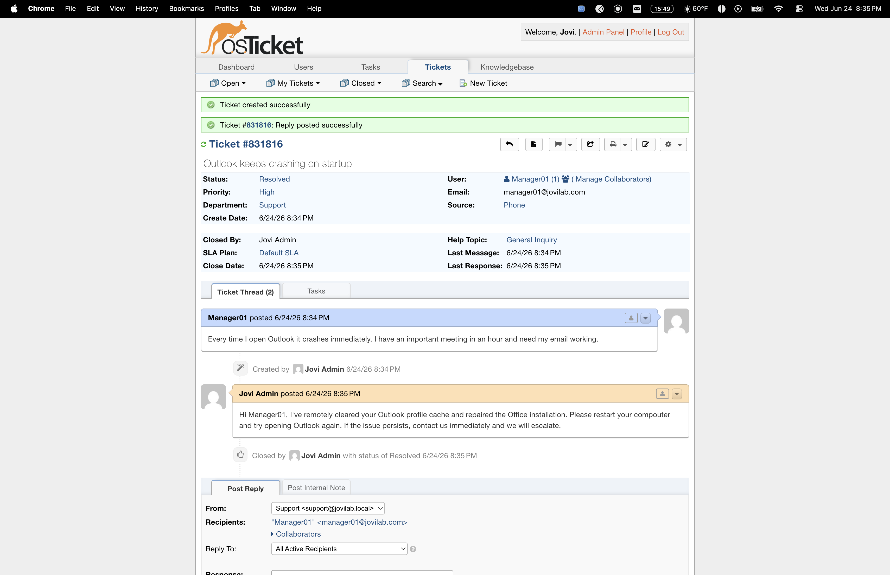

## Key Lessons
- All osTicket Docker images are amd64-only — no ARM64 builds exist. Native install on Apache/PHP/MySQL is the correct approach on Apple Silicon
- PHP must be wired to Apache via libapache2-mod-php — without it Apache serves raw PHP code instead of executing it
- VirtualBox NAT port forwarding must map Host port → Guest port 80 (not 8080) for Apache to be reachable from the Mac browser
- SSH via port forwarding (Host 2222 → Guest 22) is essential for clipboard paste into headless VMs — eliminates manual typing of long commands

## Resume Line
"Deployed and managed osTicket help desk system on native LAMP stack with documented ticket resolution workflows"
