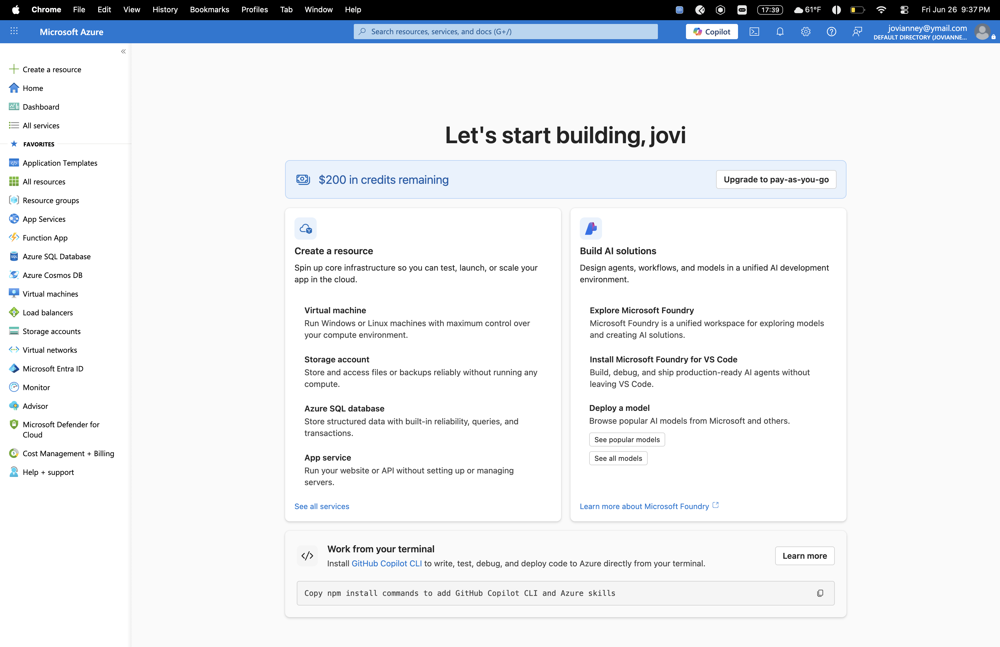
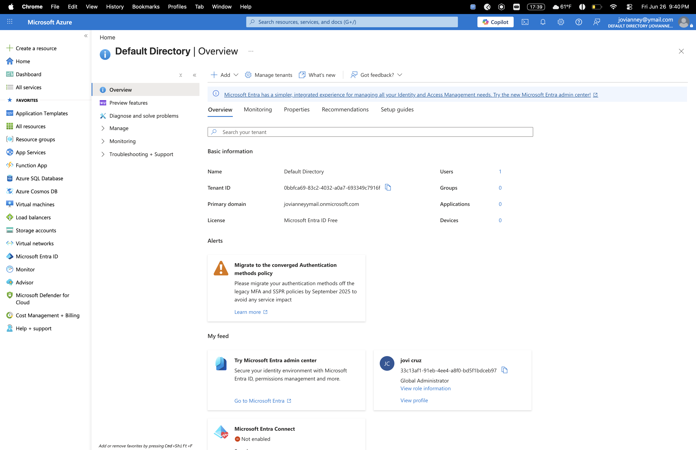
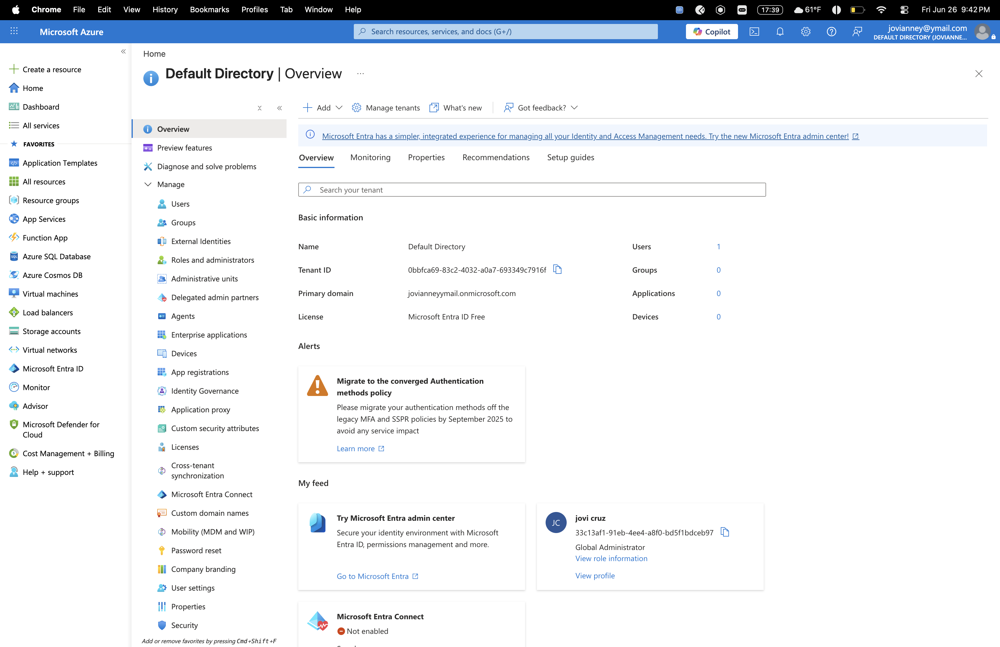
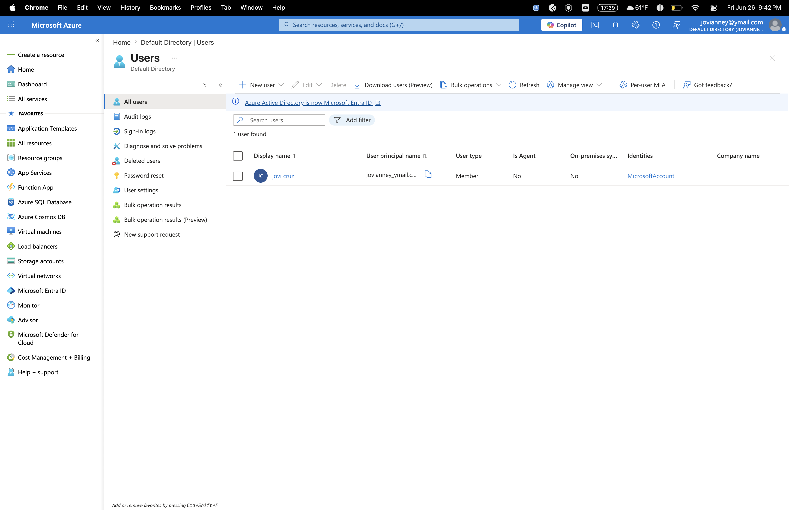
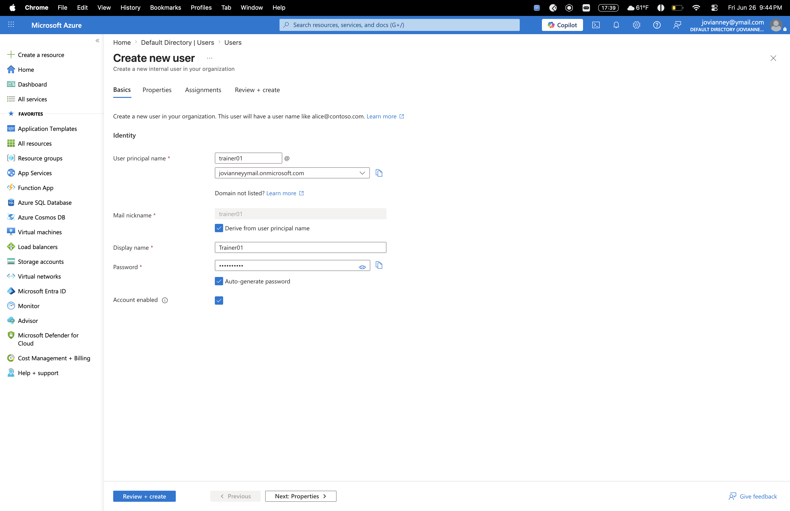
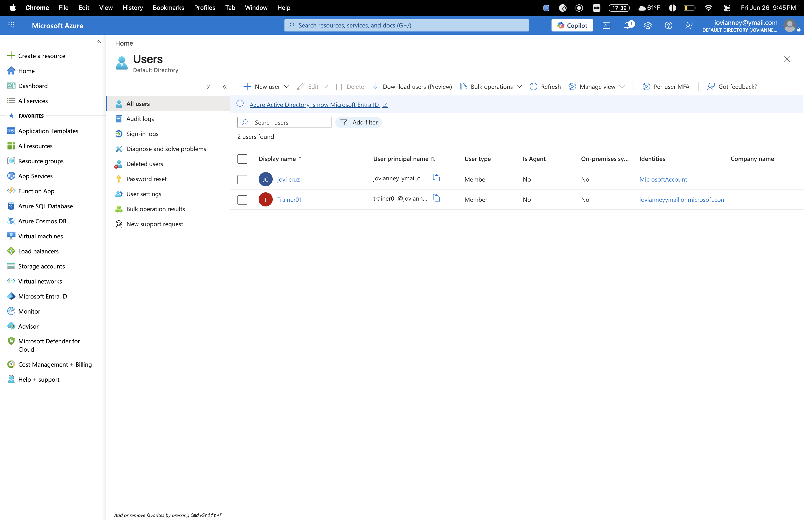
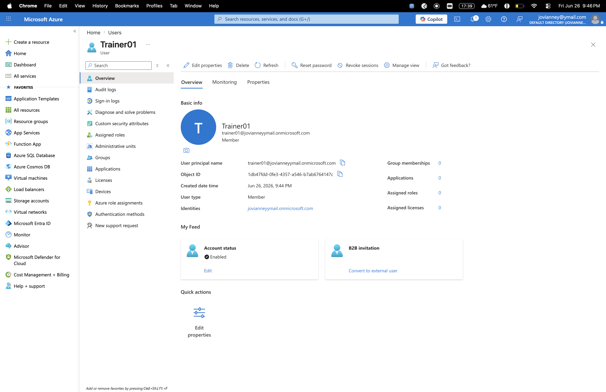

Paste this entire README:
markdown# 05 — Microsoft Entra ID Lab
**Platform:** Microsoft Azure — Entra ID Free Tier  
**Cloud Domain:** jovianneyymail.onmicrosoft.com  
**On-Prem Domain:** jovilab.local (DC01)  
**Role:** Global Administrator  

---

## Objective
Deploy and explore Microsoft Entra ID (formerly Azure Active Directory) as the cloud identity counterpart to the on-prem Active Directory domain built in Lab 02. Demonstrate understanding of hybrid identity concepts, cloud user management, and the relationship between on-prem AD and cloud-based identity providers.

---

## What is Entra ID?
Microsoft Entra ID is Active Directory in the cloud. Instead of managing users on a physical domain controller inside a building, Entra ID manages identities that work from anywhere in the world — no VPN required for cloud apps.

| On-Prem AD (DC01) | Entra ID (Cloud) |
|---|---|
| Domain: jovilab.local | Domain: jovianneyymail.onmicrosoft.com |
| Accessible via Tailscale VPN | Accessible from any browser, anywhere |
| Managed via ADUC / dsa.msc | Managed via Azure portal / Entra admin center |
| GPOs enforce policies | Conditional Access enforces policies |
| Domain join for on-prem devices | Azure AD join for cloud/remote devices |
| Password reset via net user | Password reset via portal or self-service |

The security model shifts from "are you inside our network?" to "are you who you say you are?" — this is called **Zero Trust** and it's the modern enterprise security standard.

---

## What I Did

### Step 1 — Provisioned Azure Account
Created a Microsoft Azure free account with $200 in credits. Accessed Microsoft Entra ID directly through the Azure portal at portal.azure.com.

### Step 2 — Explored Entra ID Tenant
Reviewed the Default Directory tenant as Global Administrator:
- **Tenant ID:** 0bbfca69-83c2-4032-a0a7-693349c7916f
- **Primary domain:** jovianneyymail.onmicrosoft.com
- **License:** Microsoft Entra ID Free
- **Microsoft Entra Connect:** Not enabled — this is where on-prem AD would sync to the cloud
- **Role:** Global Administrator — full control over this tenant

### Step 3 — Created Cloud User
Created trainer01 in Entra ID — the same user that exists in jovilab.local on DC01. This demonstrates the hybrid identity concept: one user represented in both on-prem and cloud directories.

**Cloud user details:**
- Display name: Trainer01
- UPN: trainer01@jovianneyymail.onmicrosoft.com
- User type: Member
- Account status: Enabled
- Created: Jun 26, 2026

---

## Key Findings
- Entra ID portal interface mirrors on-prem AD management — same concepts, cloud location
- User management actions are identical: create, disable, reset password, assign roles
- **Microsoft Entra Connect** is the bridge between jovilab.local and the cloud — when enabled it syncs users automatically so one account works everywhere
- Free tier provides full visibility into the identity platform with basic user management
- Global Administrator in Entra ID = Domain Admin in on-prem AD

## Hybrid Identity Architecture
jovilab.local (DC01)          jovianneyymail.onmicrosoft.com

├── jovi.d                     ├── jovi cruz (admin)

├── trainer01          ←→      ├── Trainer01

├── manager01          sync    └── (future sync via Entra Connect)

└── intern01

↑

Entra Connect

(not yet configured)

In a real enterprise deployment Microsoft Entra Connect would run on DC01 and automatically sync all on-prem users to the cloud. Changes made on-prem replicate to the cloud within minutes.

---

## Key Concepts

**Zero Trust** — never trust, always verify. Every login is authenticated regardless of network location. Replaces VPN as the security perimeter for cloud resources.

**Hybrid Identity** — users exist in both on-prem AD and Entra ID, synced via Entra Connect. One login works for local resources AND cloud apps like Microsoft 365, Teams, SharePoint.

**Entra Connect** — the sync engine that bridges on-prem AD to the cloud. Runs as a service on a domain controller or dedicated server.

**Conditional Access** — cloud equivalent of GPOs. Rules like "require MFA if logging in from outside the US" or "block access from unmanaged devices." Requires Entra ID P1 license.

**Global Administrator** — highest privilege role in Entra ID. Equivalent to Domain Admin on-prem. Full control over all users, groups, apps, and tenant settings.

---

## On-Prem vs Cloud — Same Skills, Different Platform
The user management controls in Entra ID are intentionally familiar to anyone who knows AD:

- Create user → same workflow as ADUC
- Reset password → same as `net user /domain`
- Disable account → same as disabling in ADUC
- Assign roles → same as adding to security groups
- View sign-in logs → same as Security Event Log 4624/4625

Microsoft built it this way deliberately so IT admins can transition from on-prem to cloud without relearning everything from scratch.

---

## Screenshots
- `05-azure-portal-dashboard.png` — Azure portal with $200 credits, Entra ID in sidebar
- `05-entra-id-azure-overview.png` — Entra ID overview: tenant ID, domain, Global Admin role, Entra Connect status
- `05-entra-id-manage-menu.png` — Full Entra ID feature set: Users, Groups, Roles, MDM, Conditional Access
- `05-entra-id-users.png` — Users list before trainer01 creation
- `05-entra-id-create-user.png` — Create new user form with trainer01 details
- `05-entra-id-trainer01-created.png` — 2 users confirmed: jovi cruz + Trainer01
- `05-entra-id-trainer01-profile.png` — Full cloud user profile with UPN, Object ID, account status

---

## What I Learned
- Entra ID is Active Directory as a cloud service — same concepts, global scale, no physical hardware
- The security model shifts from network perimeter to identity perimeter — the user account IS the security boundary
- Hybrid identity connects on-prem jovilab.local to the cloud via Entra Connect — one account works everywhere
- trainer01 now exists in both jovilab.local (DC01) and jovianneyymail.onmicrosoft.com (Entra ID) — same user, two directories
- Cloud identity management is the direction every enterprise is moving — this skill directly maps to real job requirements

---

## Files
05-Microsoft-Entra-ID-Lab/

├── README.md

├── failures.md

└── screenshots/

├── 05-azure-portal-dashboard.png

├── 05-entra-id-azure-overview.png

├── 05-entra-id-manage-menu.png

├── 05-entra-id-users.png

├── 05-entra-id-create-user.png

├── 05-entra-id-trainer01-created.png

└── 05-entra-id-trainer01-profile.png